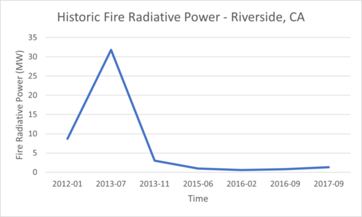
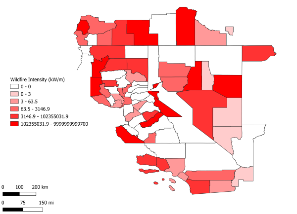

# Wildfire Analysis
**For the completion of Big Data Management**  
# Goals
- Introduce a new attribute `County` that indicates the county at which each wildfire happened.  
- Convert the file into a column-oriented Parquet format to speed up the analysis.
- Given a date range, start and end, compute the total fire intensity for each county over that time. 
- Given a specific county by name, compute the total fire intensity each month over all time and plot the result as a line chart.

# Overview
This project analyzes a dataset the represents the wildfire occurrences in the US. The dataset contains a total of 18 million points. However, we analyzed with only a subset of the data in California. Furthermore, several subsets of the data of sizes, 1K, 10K, and 100K, will be tested on to expedite the development.

 

# Data Structure

|                  x|                 y|  acq_date| frp| acq_time|County|
|-------------------|------------------|----------|----|---------|------|
|-123.79012382714633| 39.49769932079566|2014-04-16| 5.7|     2051| 06045|

## Temporal analysis
Example output of temporal analysis:  
  
Credits: Johnathan Pham

## Spatial Analysis
Example output of spatial analysis:  
  
Credits: Vraj Patel
